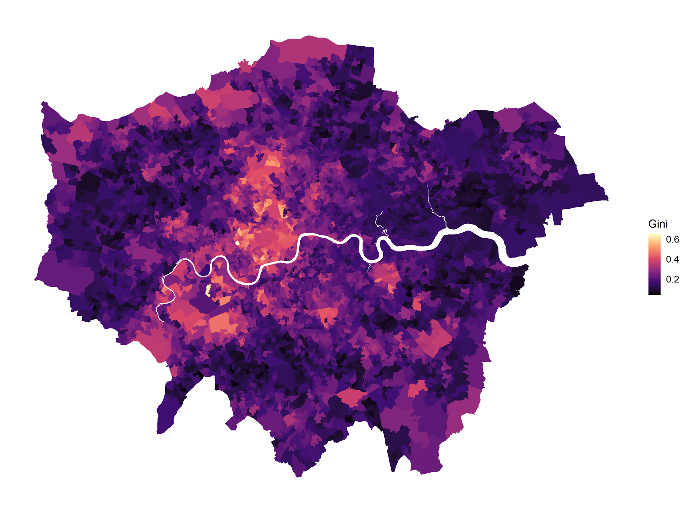

# Local economic inequality in the UK

This repo contains the code and data for an interactive map of local inequality in the United Kingdom: https://jhsuss.shinyapps.io/uk-local-inequality/

The data was collected for this paper: [*Measuring local, salient inequality in the UK*](https://papers.ssrn.com/sol3/papers.cfm?abstract_id=3958731) and includes neighbourhood-level inequality estimates -- see below an example for London.

